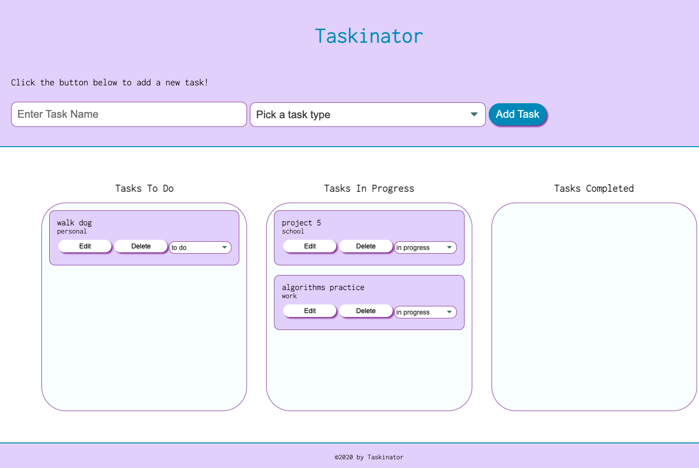

# Taskinator
A task-tracker web application

## table of contents 
- [Purpose](#purpose)
- [Technologies-Used](#Technologies-Used)
- [Getting-started](#Getting-started)
- [Contact](#Contact)

## Purpose 
Taskinator is a task tracking web application. Users are able to create task by entering a task name and selecting a type. Users are also able to organize their tasks into Tasks To Do, Tasks In Progress, and Tasks Completed lists by using the dropdown to change the task status. The application was built using Javascript and DOM API methods

## Technologies-Used
- JavaScript
- HTML
- Css
- Web Storage API
- DOM API

## Getting-started
To run the application clone the code and open the index.html page in your prefered broswer, or you can visit the deployed application at the following link https://araceli4690.github.io/taskinator/

- mock-up of deployed application
 

## Contact
If you have any questions feel free to contact me through my [Github](https://github.com/Araceli4690).